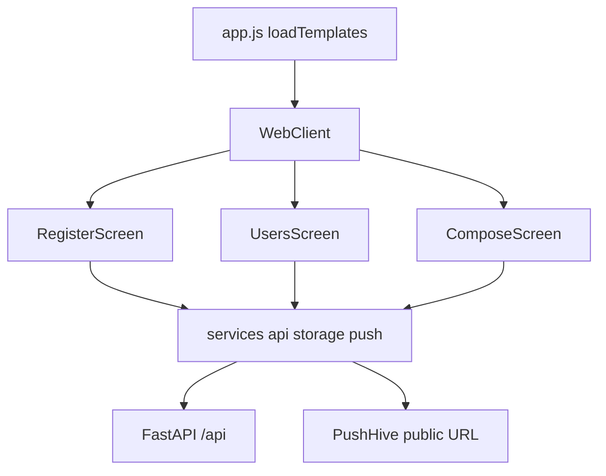

# Миграция фронтенда на каркас fastapi-owl

## Цель

Оставить рабочий бэкенд и push-сценарий как есть, а UI перевести на подход из [aayartsev/fastapi-owl](https://github.com/aayartsev/fastapi-owl):

- OWL **ESM** локально (`static/js/libs/owl.js`), не IIFE/CDN
- компоненты как **`.js` + `.xml`** (шаблоны отдельно)
- **import map** в HTML (алиасы `@odoo/owl`, `@webclient/...`, `@messenger/...`)
- отдача страницы через **Jinja2** (`templates/index.html`) с подстановкой import map
- загрузка XML через `templates_loader` + список из `build_assets.py`
- **Bootstrap** локально для оформления страниц (как в fastapi-owl: SCSS-исходники + сборка в CSS, JS-бандл при необходимости, Bootstrap Icons по желанию)
- SCSS рядом с компонентами + `libsass` в `build_assets.py` → единый `custom.css` / `app.css`

Текущий упрощённый фронт (`frontend/app.js` + `xml\`...\`` + `owl.iife.js` + самописный `styles.css`) после миграции заменяется; API `/api/*`, PushHive, SW ack, TLS-профили **не переписываем**.

## Что уже есть (не трогаем без нужды)

- FastAPI роутеры: users, messages, push/ack, config, health
- PushHive compose + seed
- PWA: `sw.js`, manifest, deviceId/session в localStorage
- TLS: local / mkcert / public Caddy

## Целевая структура фронта

```
backend/
  app/main.py              # + JinjaTemplates для GET /
  templates/
    index.html             # import map + Bootstrap CSS/JS + #app + entry
frontend/
  js/
    libs/
      owl.js               # ESM OWL
      bootstrap.bundle.min.js
    app/
      app.js
      utils/
        templates_loader.js
        xml_assets.json
      webclient/
        web_client.js / .xml / .scss
      messenger/
        register_screen.js / .xml / .scss
        users_screen.js / .xml / .scss
        compose_screen.js / .xml / .scss
      services/
        api.js, storage.js, push.js, register.js, config.js
  bootstrap/               # SCSS (и при необходимости JS src) Bootstrap, вендор как в fastapi-owl
  scss/
    custom.scss            # точка входа: bootstrap + component scss
  css/
    custom.css             # результат build_assets
    libs/                  # bootstrap-icons и шрифты при использовании
  manifest.webmanifest
  icons/
  sw.js
scripts/
  build_assets.py          # порт из fastapi-owl: XML list + sass.compile(bootstrap + app scss)
```

Import map (пример):

```json
{
  "imports": {
    "@odoo/owl": "/static/js/libs/owl.js",
    "@webclient/web_client": "/static/js/app/webclient/web_client.js",
    "@messenger/register_screen": "/static/js/app/messenger/register_screen.js",
    "@services/api": "/static/js/app/services/api.js"
  }
}
```

## Поток UI (без смены продукта)



Логика экранов и `completeRegistration` / `sendMessage` переносится из текущих модулей почти 1:1; меняется упаковка (OWL + XML) и оформление (Bootstrap).

## Оформление на Bootstrap (обязательно)

Вендорить Bootstrap **локально** (как в fastapi-owl: каталог `static/bootstrap/scss`, сборка через `libsass`, без CDN).

Экраны размечать классами Bootstrap:

| Экран | Оформление |
|-------|------------|
| Shell / WebClient | `navbar` или `container` + topbar; кнопка «Установить» — `btn btn-outline-secondary` |
| Register | `container`, `card` / `form-control`, `btn btn-primary`, `alert alert-danger` для ошибок |
| Users | список — `list-group` / `list-group-item`; «я» — `active` или `border-primary`; «Обновить» — `btn btn-secondary` |
| Compose | `form-label`, `textarea.form-control`, кнопка отправки — `btn btn-primary` (иконка Bootstrap Icons или текст); статус — `text-muted` / `alert` |

Дополнительно:

- Подключить **Bootstrap Icons** локально (как в fastapi-owl `css/libs/bootstrap-icons`), если нужны иконки (самолётик, обновить, установить)
- Кастомные отступы/цвета темы — через SCSS-переменные Bootstrap (`$primary` и т.п.) в `custom.scss` / `_variables`, не через отдельный «самописный» CSS вместо BS
- Текущий `styles.css` **не** сохраняем как основу; максимум — тонкий слой поверх Bootstrap после миграции

## Шаги реализации

### 1. Каркас fastapi-owl в этом репо

- Добавить Jinja2 (`jinja2` в requirements), `GET /` → `TemplateResponse` с `imports`
- Смонтировать статику так, чтобы `/static/js/...` работал
- Положить ESM `owl.js` в `js/libs/`
- Портировать `templates_loader.js` + `build_assets.py` (XML + SCSS)
- Убрать runtime-зависимость от `owl.iife.js` / CDN

### 2. Три экрана как компоненты

- `WebClient`: topbar/navbar, кнопка «Установить», переключение `screen`
- `RegisterScreen`, `UsersScreen`, `ComposeScreen` — шаблоны в `.xml` с классами Bootstrap
- Состояние сессии через существующий `storage.js`

### 3. Сервисный слой

- Перенести `api.js`, `storage.js`, `push.js`, `register.js`, `config.js` в `app/services/`
- Подключить через import map (`@services/...`)
- Не менять контракты HTTP

### 4. PWA

- `manifest`, иконки, `GET /sw.js` оставить
- В SW обновить cache shell-пути (`custom.css`, `app.js`, bootstrap bundle при необходимости)
- `beforeinstallprompt` остаётся в `WebClient`

### 5. Bootstrap + SCSS

- Скопировать/вендорить Bootstrap SCSS (+ `bootstrap.bundle.min.js`) из подхода fastapi-owl
- `build_assets.py`: компиляция `bootstrap.scss` + scss экранов → `css/custom.css`
- `libsass` в `requirements.txt` backend или в отдельном build-окружении
- Разметить XML экранов утилитами/компонентами Bootstrap (см. таблицу выше)
- В `index.html`: link на `/static/css/custom.css`, script bootstrap bundle (локально)
- Прогнать `python scripts/build_assets.py` в Docker build и в README для локальной разработки

### 6. Тесты и документация

- Backend: index отдаёт Jinja + import map; owl/bootstrap только локально; нет CDN
- Frontend: тесты services; наличие `.xml` экранов; `custom.css` содержит классы Bootstrap (`btn-primary` / `:root` BS-переменные); `xml_assets.json` генерируется
- README: сборка assets, Bootstrap локально, ссылка на fastapi-owl как образец

## Явные решения плана

- **Используем Bootstrap** для оформления всех экранов (локальный vendor + SCSS-сборка), по образцу [fastapi-owl](https://github.com/aayartsev/fastapi-owl).
- Todo/демо-приложение из fastapi-owl **не** копируем — только каркас и стек стилей.
- API и PushHive **не** менять.
- Один фронт после миграции (IIFE + самописный CSS удаляются), без двух параллельных SPA.

## Критерий готовности

- Три экрана работают как сейчас (регистрация → список → сообщение + push)
- Нет CDN; OWL, Bootstrap и скрипты только с нашего origin
- UI визуально опирается на Bootstrap (формы, кнопки, списки)
- Структура и DX близки к [fastapi-owl](https://github.com/aayartsev/fastapi-owl)
- Все тесты зелёные, README на русском обновлён
