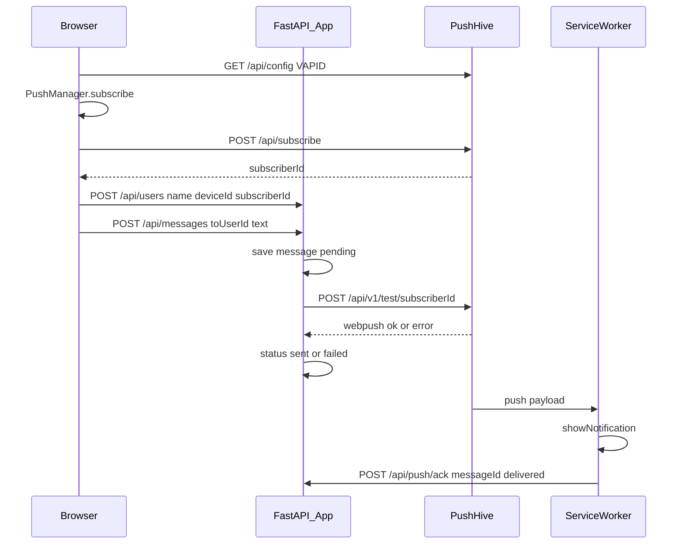
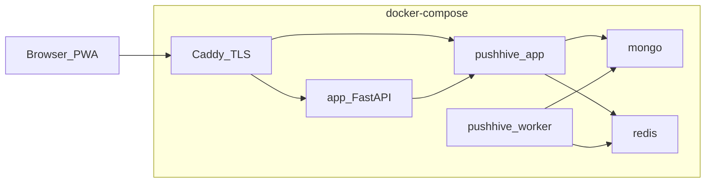

# PWA messenger + PushHive

## Решения (зафиксировано)

| Тема | Решение |
|------|---------|
| Идентификация | `localStorage`: `deviceId` (UUID), `userName`, `userId`, `pushSubscriberId` |
| Список пользователей | `GET` при входе на экран + кнопка «Обновить» |
| Push | Подписка на VAPID-ключах PushHive; отправка 1:1 через `POST /api/v1/test/:subscriberId` |
| Статусы | `pending` → `sent`/`failed` по ответу PushHive; `delivered` — callback от **нашего** SW (у PushHive нет webhook `notification.delivered` для test-send) |
| TLS | Compose-профили: `local` (HTTP/`localhost`) и `https` (Caddy + mkcert для LAN / LE для публичного домена) |

## Архитектура





## Структура репозитория

```
/
├── backend/                 # FastAPI
│   ├── app/
│   │   ├── main.py
│   │   ├── db.py            # SQLite + schema
│   │   ├── models.py
│   │   ├── routers/users.py
│   │   ├── routers/messages.py
│   │   ├── routers/push_ack.py
│   │   └── services/pushhive.py
│   ├── requirements.txt
│   └── Dockerfile
├── frontend/                # owl.js SPA + PWA
│   ├── index.html
│   ├── manifest.webmanifest
│   ├── sw.js                # push + ack + offline shell
│   ├── app.js               # owl components / screens
│   ├── styles.css
│   └── icons/
├── caddy/
│   ├── Caddyfile.local      # :80 localhost
│   └── Caddyfile.https      # TLS
├── scripts/
│   ├── setup-pushhive.sh    # clone/build env, seed admin, print API key steps
│   └── gen-mkcert.sh        # LAN certs for Caddy
├── docker-compose.yml
├── docker-compose.https.yml # override: Caddy + certs
├── .env.example
└── README.md
```

PushHive подключаем как отдельный сервис из [dhirendralive9/pushhive](https://github.com/dhirendralive9/pushhive) (build context через git clone в `vendor/pushhive` или `build: git` URL) + его mongo/redis/worker рядом в одном compose-файле.

## Схема SQLite

**users**
- `id` TEXT PK (UUID)
- `name` TEXT UNIQUE NOT NULL
- `device_id` TEXT NOT NULL
- `push_subscriber_id` TEXT NOT NULL  — Mongo `_id` подписчика в PushHive
- `created_at` TEXT

**messages**
- `id` TEXT PK (UUID)
- `text` TEXT NOT NULL
- `from_user_id` TEXT NOT NULL
- `to_user_id` TEXT NOT NULL
- `push_status` TEXT NOT NULL  — `pending` | `sent` | `failed` | `delivered`
- `push_error` TEXT NULL
- `created_at` TEXT
- `updated_at` TEXT

## API нашего бэкенда

- `GET /api/vapid-proxy` или фронт ходит в PushHive напрямую за `GET /api/config` (через Caddy `/pushhive/*`) — в плане: фронт → PushHive `/api/config` + `/api/subscribe` с site API key из конфига, отданного нашим `GET /api/config` (чтобы не светить лишнее в HTML; ключ site для SDK всё равно нужен клиенту, как у PushHive).
- `POST /api/users` — `{ name, device_id, push_subscriber_id }` → 201 или 409 если имя занято.
- `GET /api/users` — список `{ id, name }` (включая себя).
- `POST /api/messages` — `{ from_user_id, to_user_id, text }` → создаёт запись, вызывает PushHive, обновляет статус, возвращает сообщение.
- `POST /api/push/ack` — `{ message_id, status: "delivered" }` от SW (без сложной auth на MVP; при желании простой shared secret в заголовке).
- Статика `/` — SPA; `/sw.js`, `/manifest.webmanifest`.

### Интеграция PushHive (`services/pushhive.py`)

1. Регистрация site + API key — один раз через dashboard/seed (скрипт `setup-pushhive.sh` + README).
2. Отправка 1:1: `POST {PUSHHIVE_URL}/api/v1/test/{push_subscriber_id}` с заголовком `X-API-Key`, body:
   - `title`: `From {from_name}`
   - `body`: текст сообщения
   - `url`: `{PUBLIC_APP_URL}/?m={message_id}` — id для ack в SW
   - `icon`: иконка PWA
3. Успех webpush → `sent`; исключение/5xx → `failed` + `push_error`.
4. Опционально позже: webhook `campaign.sent`/`failed` не используем для 1:1 (test-send не создаёт campaign webhook).

## Frontend (owl.js)

Три экрана в одном SPA (роутинг по состоянию + `localStorage`):

1. **Register** — поле имени; перед submit: ensure `deviceId`, запрос permission, subscribe (VAPID из PushHive config), `POST /api/subscribe` → `subscriberId`, затем `POST /api/users`. Ошибка уникальности — показать текст.
2. **Users** — `GET /api/users`, подсветка своего имени, кнопка «Обновить», тап по имени → экран 3.
3. **Compose** — «Кому: {name}», textarea, кнопка-самолётик → `POST /api/messages`; краткий статус отправки.

PWA: `manifest.webmanifest` (`display: standalone`), install prompt через `beforeinstallprompt` (кнопка «Установить», если событие есть).

**Service worker (`sw.js`)**:
- `install`/`activate` — cache shell.
- `push` — разобрать JSON payload PushHive (`title`, `body`, `url`); `showNotification`; вытащить `message_id` из query `m` в `url`; `fetch('/api/push/ack', { message_id, status: 'delivered' })`.
- `notificationclick` — открыть/фокус окна на `url` (минимальный UI: системное уведомление + при клике приложение с query).

Подписку делаем **сами** (`PushManager` + наш SW), затем регистрируем subscription в PushHive через `POST /api/subscribe` — так мы контролируем ack и совпадаем с моделью «стандартный Web Push», а PushHive остаётся транспортом.

## Docker / TLS

**`docker-compose.yml` (профиль local):**
- `app` (FastAPI, volume sqlite)
- `pushhive` app + worker + mongo + redis (порты только во внутренней сети; наружу через Caddy или прямой `:3000` для dashboard)
- Caddy на `:80` → `app:8000`, path `/ph/*` → `pushhive:3000` (чтобы same-origin или CORS настроить осознанно)

**Same-origin предпочтительно:** Caddy отдаёт приложение с `/`, PushHive API с префикса `/ph/` (потребует strip prefix или env `PUBLIC_URL` у PushHive). Если strip сложен для SDK PushHive — два хоста в Caddy: `app.localhost` и `push.localhost` (mkcert оба).

**Практичный выбор для плана:** два имени хоста под одним Caddy:
- local HTTP: `http://localhost` (app), `http://localhost:3000` (PushHive dashboard/API) + CORS на PushHive/site domain
- https: `https://pwa.lan` и `https://push.lan` (mkcert) или один домен с path reverse-proxy после проверки

**`docker-compose.https.yml`:**
- Caddy с `tls /certs/cert.pem /certs/key.pem` (mkcert) для LAN-имён/`PUBLIC_HOST`
- Документировать: установить root CA mkcert на телефон; DNS/hosts или mDNS на IP машины
- Публичный сервер: тот же Caddyfile с `tls` автоматическим Let's Encrypt при реальном DNS на сервер

## Конфиг (`.env.example`)

- `PUBLIC_APP_URL`, `PUSHHIVE_URL`, `PUSHHIVE_API_KEY`
- `DATABASE_PATH=/data/app.db`
- `ACK_SECRET` (опционально)
- PushHive: `VAPID_*`, `SESSION_SECRET`, `MONGODB_URI`, Redis

## Порядок реализации

1. Каркас compose + FastAPI health + SQLite schema + пустая статика.
2. Users API (уникальность имени) + Messages API без push.
3. Поднять PushHive в compose, seed admin, создать Site, сохранить API key.
4. Клиент: subscribe → register user; SW + ack; send через test API.
5. Три экрана owl.js + manifest/install.
6. Caddy local + https/mkcert профиль и README (localhost / LAN / public).

## Ограничения PushHive (явно)

- `POST /api/v1/send` шлёт по тегам/всем, не по одному subscriber — для чата используем **`/api/v1/test/:subscriberId`**.
- Webhooks: `campaign.sent/failed`, `notification.clicked/dismissed` — **нет** `notification.delivered` → `delivered` только через наш SW ack.
- PushHive тянет MongoDB + Redis + worker — стек тяжелее «тонкой обёртки», но соответствует выбранному проекту.
